# Git-Vision

**Git-Vision** es una herramienta visual para explorar y analizar repositorios Git. Permite a los usuarios visualizar la historia de commits, issues, contribuciones y, si se integra con Clockify, también gestionar análisis de tiempo y productividad.

---

# Funcionalidades

Según la integración con Clockify, Git-Vision ofrece diferentes niveles de funcionalidad:

## Sin cuenta de Clockify

- **Exploración de repositorios Git**:
  - Visualización de archivos y carpetas.
  - Historial de commits e issues.
  - Detalles de archivos, carpetas, commits e issues.

- **Estadísticas**:
  - Gráficos de contribuciones en un rango de tiempo.
  - Análisis de contribuciones por usuario en cada issue.
  - Visualización de archivos modificados por contribuidor.

## Con cuenta de Clockify enlazada

- **Estadísticas adicionales**:
  - Análisis del número de cambios realizados por un usuario respecto al tiempo invertido, utilizando datos de Clockify.

---

# Manual de Usuario

---

## Registro

- Accede a **Registro** en la pantalla principal.
- Completa los campos: usuario de GitHub, token válido que puedas utilizar con esta cuenta, email y contraseña.

> ℹ️ **Info**: Para obtener un token en GitHub, ve a Settings → Developer settings → Personal access tokens, haz clic en Generate new token, selecciona los permisos y crea el token. Se recomienda pulsar todos aquellos permisos de lectura.

## Inicio de Sesión

- Ingresa nombre de usuario y contraseña.

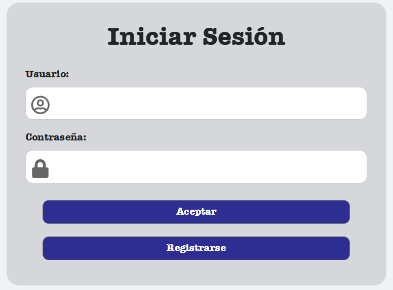

---

## Página Principal (Home)

Dependiendo de tu integración con Clockify, la pantalla inicial cambia:

### Sin Clockify

- Listado de repositorios disponibles.
- Opción para agregar nuevos repositorios.

### Con Clockify

- Listado de repositorios y workspaces disponibles.
- Opción para agregar nuevos repositorios y workspaces.
- Opción de enlazar un workspace a un repositorio.

---

## Gestión de Repositorios y Workspaces

### Descarga de Repositorio

- Introduce el propietario y nombre del repositorio GitHub.
- Puedes utilizar un token personalizado para las peticiones relacionadas a este repositorio, por defecto será utilizado el suyo.

> ⚠️ **Advertencia**: En caso de utilizar un token no válido para este repositorio es posible salten errores.

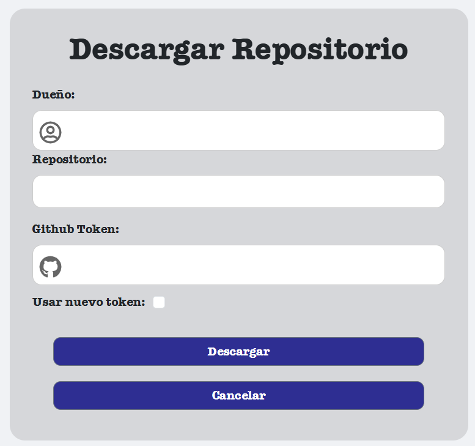

---

### Descarga de Workspace (Clockify)

- Ingresa el id perteneciente a ese workspace.
- Ingresa un nombre que quieras asociar a dicho workspace, debe ser único respecto a otros workspaces que hayas añadido.

> ℹ️ **Info**: Para encontrar el ID de un workspace (espacio de trabajo) en Clockify, puedes buscarlo en la barra de direcciones de tu navegador. Después de abrir la configuración del workspace, la URL mostrará el ID del workspace, por ejemplo, https://clockify.me/workspaces/518ad43641f9dg74egfbbgaf/settings, donde 518ad43641f9dg74egfbbgaf es el ID. 

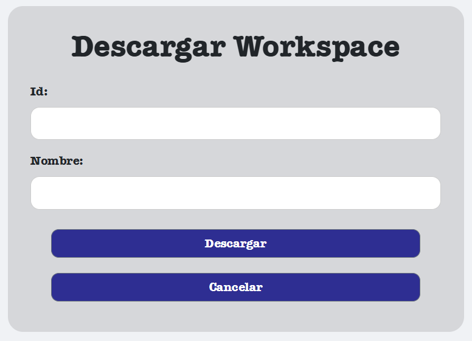

---

### Enlace de un Repositorio a un Workspace

Asocia repositorios locales a espacios de trabajo de Clockify para mostrar el análisis de tiempo invertido.

- Selecciona el owner del repostorio de los existentes disponibles en tu cuenta.
- Selecciona el nombre del repositorio del owner que has elegido.
- Selecciona el workspace al que quieres enlazar el repositorio.

Una vez enlazado un workspace con un repositorio, se podrá ver visualmente de la siguiente forma

---

## Perfil de Usuario

Consulta o edita los detalles de tu cuenta de Git-Vision.

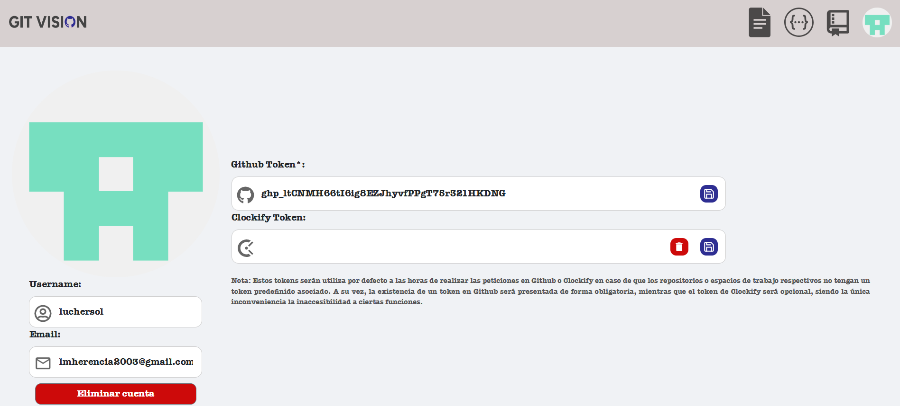

### Enlazar cuenta a Clockify

Para enlazar tu cuenta de Clockify necesitas generar un token de Clockify y añadirlo en tu perfil de usuario de Git-Vision.

> ℹ️ **Info**: Para generar un token en Clockify, inicia sesión en tu cuenta, ve a la configuración de tu perfil, desplázate hasta la sección API y haz clic en "Generar". Copia la clave generada, ya que no podrás verla nuevamente.

---

## Configuración

Permite personalizar las opciones de análisis para repositorios y workspaces.

### Configuración de Repositorio

Gestiona alias de usuarios para mejorar la precisión del análisis de contribuciones.

  

Para una demostración de cómo se urilizaría se mostrará en las siguientes imágenes la diferencia en una gráfica cuando a un usuario se le pone la configuración correcta respecto a que autores de commits están asociados a su cuenta.

- Sin configuración de repositorio:

- Con configuración de repositorio:

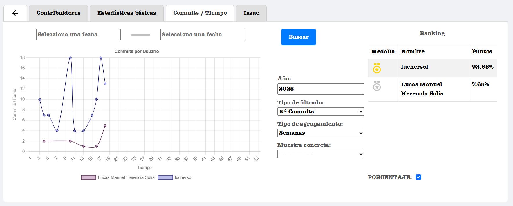

### Configuración de Workspace

Gestiona la relación que existe entre el usuario de Clockify de dicho Workspace con el username de GitHub que utiliza en el repositorio que tenga enlazado.

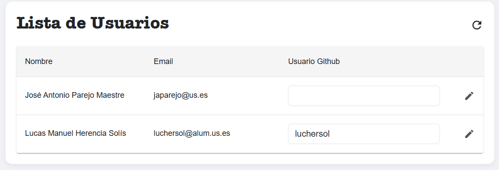

---

# Exploración del Repositorio

## Listado de Archivos

Navegación por la estructura de carpetas y archivos de cada repositorio y visualización tanto de gráfica de lenguajes del repositorio con la posibilidad de ver el porcentaje o tamaño en bytes de su totalidad y tabla de contador de extensiones del archivo.

> ℹ️ **Info**: Aquellos archivos que no tengan una extensión que se haya podido extraer serán marcados que su extensión es "Unknown".

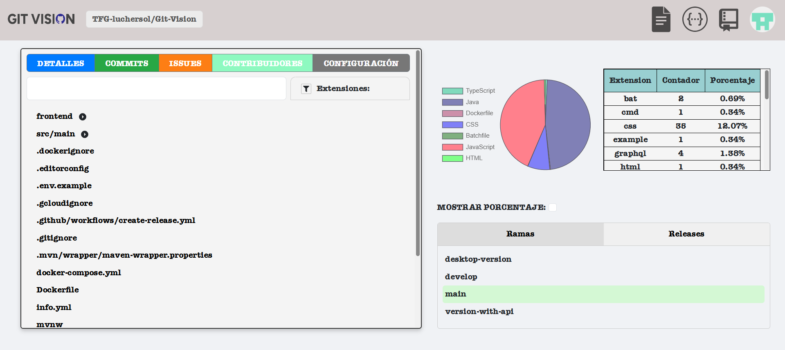

### Detalles de Archivos

- Visualización de contenido.
- Contribuciones en el archivo.

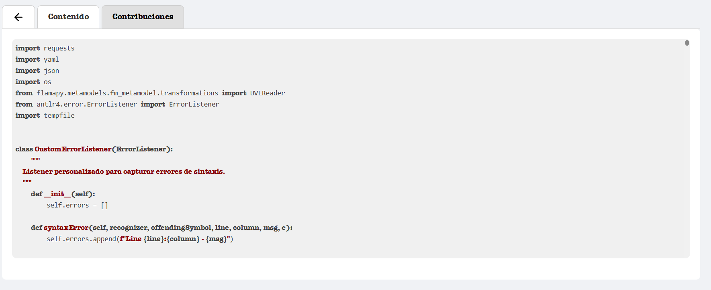

### Detalles de Carpetas

- Visualización de archivos y carpetas contenidas.
- Contribuciones en archivos de la carpeta.

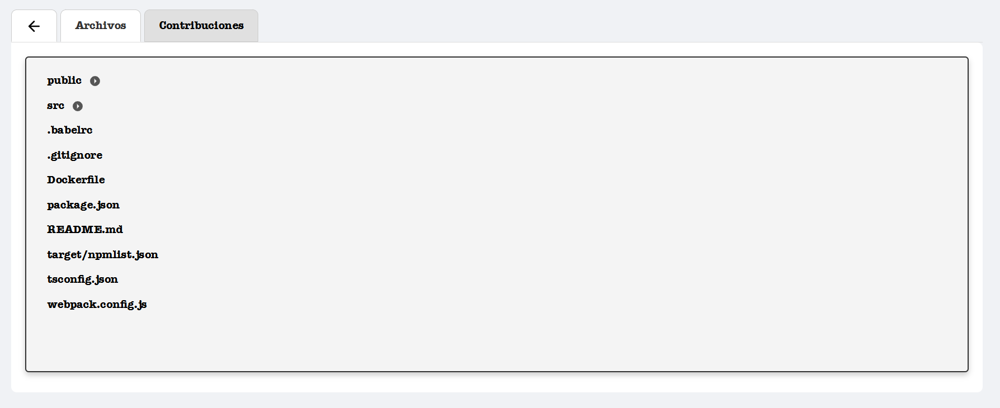

En ambos casos las contribuciones se ven de la forma que se muestra a continuación, pudiendose en esta:
- Filtrar la petición por fechas al realizar su búsqueda.
- Clasificar si para los conteos queremos tener en cuenta adiciones, eliminaciones, cambios o número de commits.
- Clasificar los agrupamientos por meses o semanas del año seleccionado además de poder seleccionar un mes o semana concreta en los respectivos pasos.
- Visualizar una tabla de clasificación en el que el puntaje puede ser el número de tipo de contribuciones hechas o el porcentaje relativo de este respecto al total adquirido.

> ⚠️ **Advertencia**: La petición puede tardar en caso de existir un gran número de commits. Se recomienda realizar el filtrado de fechas en caso de que solo te interese ver la respuesta en un periodo concreto, ya que a mayor número de elementos a analizar son realizadas más peticiones y esto produce un mayor costo y tardanza.

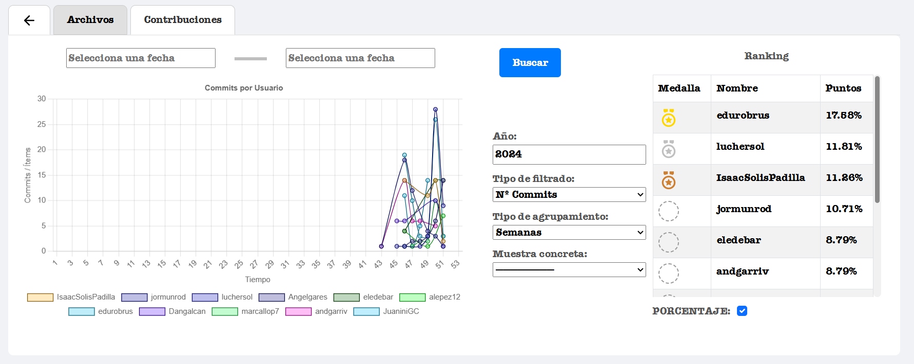

---

## Listado de Commits

Accede a un listado completo de commits por orden cronológico.

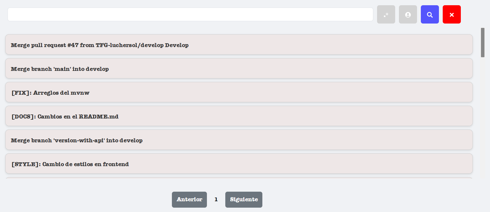

### Detalles de Commit

Visualiza detalles de cada commit:

- Mensaje.
- Cuerpo del commit en caso de tenerlo.
- Archivos modificados.
- Issues relacionadas.

> ℹ️ **Info**: Los commits pueden incluir un cuerpo en caso de realizar un salto de línea.

  
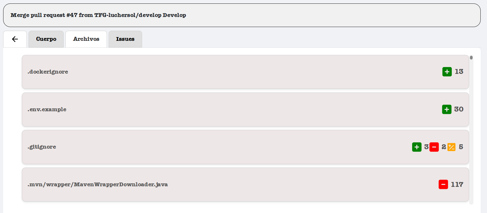  
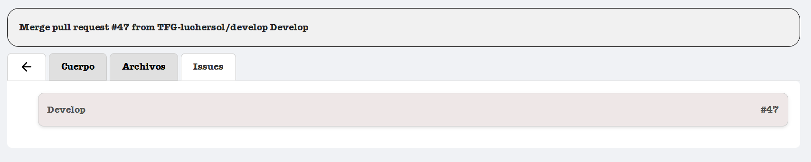

---

## Listado de Issues

Consulta todas las issues relacionadas con el repositorio.

### Detalles de Issue

- Titulo de la issue
- Número de la issue
- Estado actual (abierta, cerrada).
- Número de cambios por usuario en dicha issue.
- Commits asociados a la issue.
- Archivos modificados en la issue.

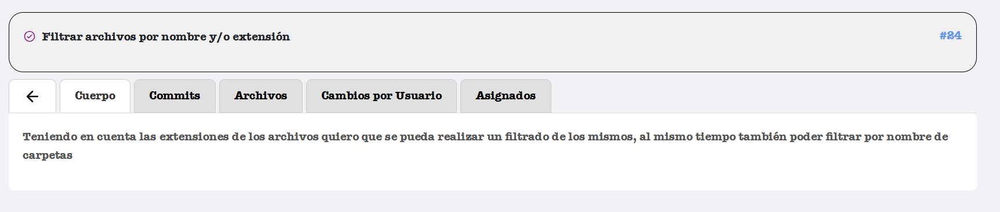

---

# Estadísticas y Análisis

## Contribuidores

Dentro del apartado de contribuidores se pueden

### Listado de Contribuidores

Visualiza todos los usuarios que han contribuido al proyecto.

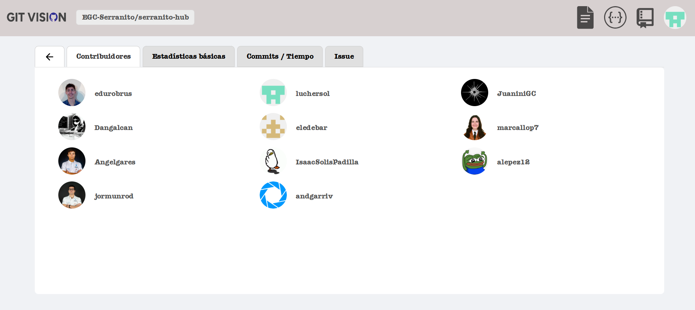

#### Detalles de Contribuidor

Al pulsar en un usuario podemos ver diferentes datos acerca de estadísticas del mismo

- Modificaciones realizadas

##### Modificaciones en Archivos

Muestra los archivos modificados por dicho usuario además de los cambios realizados junto a los commits de estos.

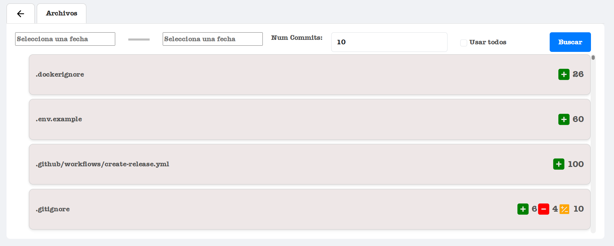

> ⚠️ **Advertencia**: La petición de analisis realice un coste de N peticiones, siendo estas el total realizadas. Para que esto suponga un coste computacional menor se recomienda seleccionar un rango de fecha para su extracción además de poner el número de commits que se quieren analizar, siendo estos los 10 últimos dentro del rango de fechas. Si a pesar de las advertencias quieres extraer todos, puedes dejar las fechas en blanco y marcar la casilla "Usar todos".

Además del listado de archivos cambiados junto a su número de cambios, se podrá visualizar los commits que los han probocado y los paths de estos cambios.

---

### Visualización de Commits en el Tiempo

Se puede realizar una visualización gráfica de los cambios realizados por cada usuario

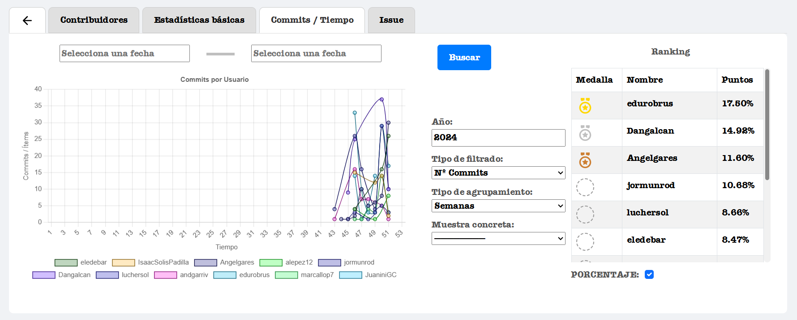

---

### Contribuciones en una Issue

Visualiza cómo cada contribuidor ha trabajado sobre una issue específica, basado en los commits que la mencionan.
Dichas contribuciones se pueden visualizar a través de adiciones, borrados o cambios realizados en ellas.

- Marca si quieres buscar una issue por su nombre o número de issue.
- Introduce el nombre de la issue o su número asociado según la elección escogida.

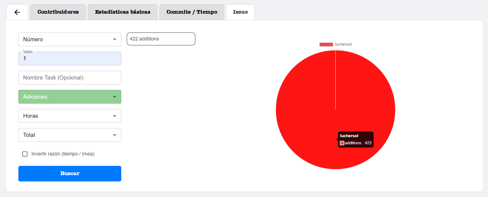

> ⚠️ **Advertencia**: En caso de realizar un filtrado por nombre, puede ser menos preciso, ya que esto provocará que se encuentre la primera issue que tenga el nombre exacto que se pasa por parámetro.

En caso de tener enlazada una cuenta de Clockify, podrás añadir otros campos y visualizar una nueva forma de la gráfica que representará dichas contribuciones partidas por el tiempo empleadas en ella a través de cierta trazabilidad por Clockify. Por defecto, se tomará que el nombre de las tasks enlazadas a dichas issues tendrá el mismo nombre que las mismas (Por ejemplo: Si buscas la issue número 1, la task será #1, si buscas la issue por nombre "Generar Login", las tasks asociadas serán "Generar Login"). En caso de querer que el nombre de la task sea otro diferente, se permitirá poner en el campo opcional existente

---

# Notas Adicionales

- Se recomienda siempre configurar correctamente los alias de usuarios para obtener mejores resultados en el análisis de contribuciones.
- Las peticiones son realizadas haciendo uso de tu token de Clockify, por lo que el uso repetido de búsquedas 
puede realizar un alcance de llamadas posible. A pesar de que de normal tenemos 5000 llamadas / hora en GitHub y se intente minimizar el uso de estas, sigue existiendo la posibilidad de llegar a dicho límite. 
- Para aprovechar la integración de Clockify, es importante tener los proyectos y tareas correctamente estructurados en Clockify.

---

